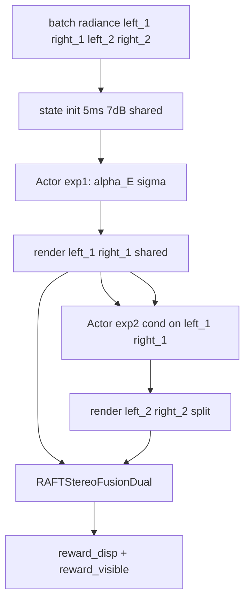

# Action Space and Reward Research Plan

面向 `stereo/modeling/models/ouradpaenet`：双目双曝光 + 特征融合 + A2C 曝光控制。本文档供实现阶段直接对照执行。

---

## 1. 设计原则

| 项 | 约定 |
|----|------|
| 动作形式 | 相对更新，初始曝光 `[5ms, 7dB]`，禁止绝对曝光动作 |
| time/gain 拆分 | 由 actor 输出的曝光量 `E` 与分配因子 `σ` 拆分，**禁止** `exposure_value_equation()` |
| 第一次曝光 | 双目共享 mid anchor：`t_left=t_right`，`g_left=g_right` |
| 第二次曝光 | 左右中心对称分离（under/over），以第一次渲染图为条件 |
| Reward | 仅 `reward_disp` + `reward_visible` |
| 成像 | 使用 [`ae_util.py`](stereo/modeling/models/ae_util.py) 的 `ImageFormationModel`（含 motion blur、噪声） |

---

## 2. 曝光预算与 time/gain 拆分

### 2.1 曝光预算标量

用线性增益与时间的乘积表示有效曝光量（与成像能量单调相关）：

```text
B = t_ms * g_linear(g_dB)
g_linear(g_dB) = 10^(g_dB / 20)
```

配置默认范围（与 `cfgs/ouradpaenet/*.yaml` 一致）：

```text
t_ms ∈ [1.0, 20.0]
g_dB ∈ [1.0, 20.0]
g_linear ∈ [1.0, 10.0]

B_min = 1.0 * 1.0   = 1.0
B_max = 20.0 * 10.0 = 200.0
B_init = 5.0 * 10^(7/20) ≈ 11.18
```

### 2.2 拆分公式

Actor 多头输出 **曝光量因子** `α_E`（见 §3）与 **分配因子** `σ_alloc = sigmoid(logits_σ)`。

对目标预算 `B_target`（由当前 `B` 与 `α_E` 相乘得到）：

```text
t_ms   = σ_alloc * B_target^(1/2) * k_t    # 再 clamp 到 TIME_LIMITS
g_dB   = ratio_to_dB( (1 - σ_alloc) * B_target^(1/2) * k_g )  # 再 clamp 到 GAIN_LIMITS
```

**简化实现（与初版计划一致，推荐 v1）**：若希望公式更短，可直接令抽象曝光量 `E` 为 budget：

```text
B_target = B_current * α_E
t_ms     = clamp(σ_alloc * B_target / g_linear_ref,  t_min, t_max)
g_dB     = clamp(ratio_to_dB(B_target / t_ms),       g_min, g_max)
```

其中 `g_linear_ref = g_linear(g_init)` 或 `1.0`，第二步反解保证 `t * g_linear(g_dB) ≈ B_target`。

拆分后写入 state：`[t_left, t_right, g_left, g_right]`，再调用 `ImageFormationModel(radiance, t, g)`。

### 2.3 初始 state

```text
INIT_TIME = 5.0 ms
INIT_GAIN = 7.0 dB
state_0 = [5.0, 5.0, 7.0, 7.0]   # 第一次共享
```

第二次初始可与第一次相同，由 actor 第一步相对更新后分离。

---

## 3. Actor：多头 + custom_activation

### 3.1 多头结构

共享 backbone（ConvEncoder）后分 **两个 head**（每路曝光各一组；第二次左右各一组）：

| Head | 输出 | 激活 | 含义 |
|------|------|------|------|
| `head_E` | `logits_E` | custom_activation | 曝光量相对因子 `α_E ∈ [M⁻¹, M]` |
| `head_σ` | `logits_σ` | sigmoid | 分配因子 `σ_alloc ∈ (0,1)` |

**第一次曝光（exp1）**：1 组 `(head_E, head_σ)`，左右共用，渲染 `left_1/right_1`。

**第二次曝光（exp2）**：2 组 `(head_E_l, head_σ_l)`、`(head_E_r, head_σ_r)`，**条件输入包含 `left_1, right_1`**（与 radiance、归一化 state 拼接）。

建议模块名：`DualExposureActor`，观测通道示例：

```text
exp1_obs: [left_rad, right_rad, state_4ch_tiled]           # C=6+4
exp2_obs: [left_rad, right_rad, left_1, right_1, state_4ch] # C=12+4
```

### 3.2 custom_activation（曝光量因子）

```text
σ(x) = sigmoid(logits_E)   # 注意：与分配因子 σ_alloc 不同，记为 s_E 避免混淆

α_E = exp( 2 * (s_E - 0.5) * log(M) )
    = M^( 2*s_E - 1 )

取值范围：s_E=0 → α_E=M⁻¹；s_E=0.5 → α_E=1；s_E=1 → α_E=M
```

**相对更新**（每 rollout step、每眼/每曝光独立）：

```text
B_next = B_current * α_E
```

再经 §2.2 拆成 `(t, g)` 写入 state。

PyTorch 参考：

```python
def custom_activation(logits, M: float):
    s = torch.sigmoid(logits)
    return torch.exp(2.0 * (s - 0.5) * math.log(M))
```

### 3.3 超参数 M 的确定

`M` 控制**单步**曝光预算最大倍率。由 `B = t * g_linear(g)` 与物理上下界推导：

```text
单步最大上调：α_E,max = B_max / B_current
单步最大下调：α_E,min = B_current / B_min  →  等价 α_E ≥ B_min/B_current

最保守（一步从 B_init 到 B_max）：M_max = B_max / B_init ≈ 200/11.18 ≈ 17.9
最保守（一步从 B_init 到 B_min）：M_min_step = B_init / B_min ≈ 11.2

ROLLOUT_STEPS = K 时，每步允许更温和：
M = (B_max / B_min) ^ (1 / K) = 200^(1/K)

K=1 → M≈200（过大，不推荐）
K=3 → M≈5.85  → 建议取 M=6
K=5 → M≈3.11  → 建议取 M=3
```

**推荐默认值**：`ACTION_MULTIPLIER_M = 6`（`ROLLOUT_STEPS=3`），配置可覆盖。

实现时在 env 内对 `B_next` 再 `clamp(B_min, B_max)`，防止多步累积越界。

### 3.4 策略分布与 log_prob

- `head_E`：`logits_E` 经 Gaussian + tanh 采样得 `s_E_pre`，再 `α_E = custom_activation(s_E_pre)`；或直接在 `logits_E` 上 Normal，经 custom_activation 映射（注意 Jacobian，实现时可对 `log(s_E)` 空间采样简化）。
- `head_σ`：Gaussian + sigmoid，与现有 `A2CActor` 类似。
- 总 `log_prob = log_prob_E + log_prob_σ`（各 head 求和）。

**v1 简化**：`head_E` 输出 `logits_E`，`s_E = sigmoid(logits_E + noise)`，`α_E = custom_activation(s_E)`，log_prob 在 `logits_E` 空间用 Normal 近似（与 `adaptiveaenet` 离散 STE 类似，先求跑通）。

---

## 4. State 空间

```text
state = [t_left, t_right, g_left, g_right]   # float32, shape [B, 4]
```

| 阶段 | 约束 |
|------|------|
| 第一次渲染 | `t_left=t_right`，`g_left=g_right` |
| 第二次渲染 | 左右可不同；由 exp2 两个 head 分别更新 `B_l, B_r` 再拆分 |

Env 可内部缓存 `B_left, B_right`；rollout 日志同时记录 `α_E, σ_alloc, B`。

---

## 5. Rollout 数据流



单步循环（`ROLLOUT_STEPS` 次）：

1. 用当前 state 渲染四帧（或仅更新后渲染，与现 `rollout_episode` 一致）。
2. `RAFTStereoFusionDual` → `disp_pred`，算 `loss_before/after`。
3. Actor exp1 → 更新共享 `B` → 拆 `t,g` → state（第一次）。
4. 渲染 `left_1/right_1`。
5. Actor exp2（条件 `left_1/right_1`）→ 更新左右 `B` → 拆 `t,g` → state（第二次）。
6. 渲染 `left_2/right_2`；再 forward stereo；算 reward；存 transition。

---

## 6. Reward

```text
reward = w_disp * reward_disp + w_visible * reward_visible
```

```text
reward_disp    = clip(loss_before - loss_after, -clip_disp, clip_disp)
reward_visible = mean_pixel( max(valid(luma_left_1), valid(luma_right_1),
                                valid(luma_left_2), valid(luma_right_2)) )

valid(l) = sigmoid((l - dark) / soft) * sigmoid((sat - l) / soft)
```

默认：`w_disp=1.0`，`w_visible=0.1~0.3`（配置项），`dark=0.03`，`sat=0.97`，`soft=0.02`。

---

## 7. 实现任务清单（执行顺序）

### 7.1 `stereo/modeling/models/ouradpaenet/submodules.py`

- [ ] `custom_activation(logits, M)` 工具函数
- [ ] `budget_from_tg(t, g)` / `tg_from_budget(B, sigma_alloc, limits)` 拆分与反解
- [ ] 替换 `AbsoluteExposureEnv` → `DualExposureEnv`：
  - `state`: `[B,4]`
  - `get_initial_state()` → `[5,5,7,7]`
  - `apply_exp1(action)` / `apply_exp2(action_l, action_r)`
  - `render_first_pair` / `render_second_pair`
  - 使用 `ae_util.ImageFormationModel`（替换当前简化版）
- [ ] `DualExposureActor`：exp1 / exp2 多头，exp2 输入含 `left_1,right_1`

### 7.2 `stereo/modeling/models/ouradpaenet/adp_ae.py`

- [ ] 基类改为 `RAFTStereoFusionDual`（或组合 fusion 模块）
- [ ] 重写 `rollout_episode`：按 §5 数据流
- [ ] `_compute_reward`：`reward_disp` + `reward_visible` only
- [ ] transition 字段：`alpha_E`, `sigma_alloc`, `B`, `t_*`, `g_*`, `reward_disp`, `reward_visible`

### 7.3 `cfgs/ouradpaenet/*.yaml`

```yaml
INIT_TIME: 5.0
INIT_GAIN: 7.0
TIME_LIMITS: [1.0, 20.0]
GAIN_LIMITS: [1.0, 20.0]
ACTION_MULTIPLIER_M: 6
DISP_REWARD_WEIGHT: 1.0
VISIBLE_REWARD_WEIGHT: 0.2
REWARD_DISP_CLIP: 0.5
DARK_THRESH: 0.03
SAT_THRESH: 0.97
VALID_SOFTNESS: 0.02
```

### 7.4 不变部分

- `A2CTrainerTemplate` / `RLTrainer` 训练循环可复用
- 默认 `set_stereo_requires_grad(False)`，仅训 actor/critic

---

## 8. 验证

```bash
conda run -n openstereo python -V
CUDA_VISIBLE_DEVICES=7 conda run -n openstereo python <smoke_test_dual_exposure.py>
```

| 检查项 | 预期 |
|--------|------|
| `custom_activation` | `s_E=0.5→1`；`s_E=0→1/M`；`s_E=1→M` |
| `M=6, B_init≈11.18` | 单步 `B` ∈ [1.86, 67.1]（乘除 6） |
| exp2 条件输入 | 改变 `left_1/right_1` 时 `α_E` 分布变化 |
| σ_alloc | →0 时 `t` 变小、`g` 相对变大；→1 相反 |
| rollout | 无 NaN；`reward` 有限 |
| 对比 | `w_visible=0` vs `0.2` |

---

## 9. 风险（简）

- `t`/`g` 单位不同，必须用 budget `B` 做相对更新，再反解到 `(t,g)`。
- `α_E` 与 `σ_alloc` 符号都用 σ 易混淆：代码中命名为 `s_E` 与 `sigma_alloc`。
- 第二次左右曝光不一致，matching 依赖第一次 anchor + fusion；勿去掉 `left_1/right_1` 条件输入。
- 数据集 `left_2/right_2` 若为下一时刻帧，与“同场景双曝光”语义不同；实现前确认数据或仅用 radiance 重渲染。
